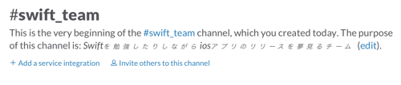
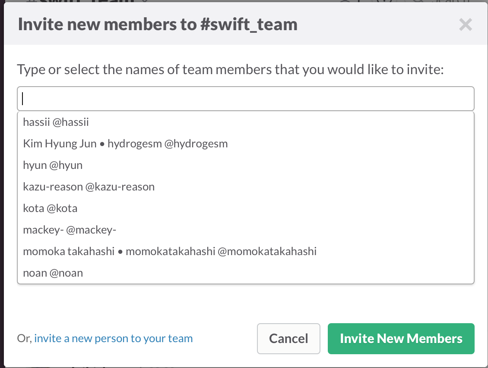
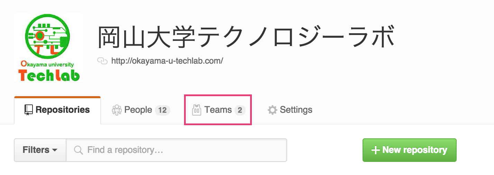
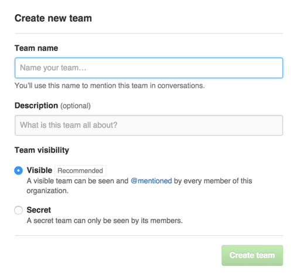
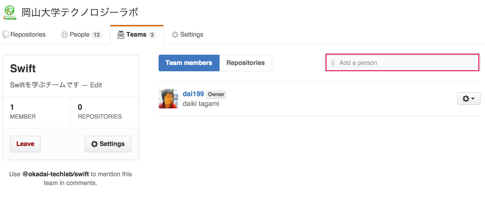

## How to create study team

てくらぼではそれぞれのチームがチームメンバーの予定に合わせて活動を行います。
また、チームはいつでも誰でも作ることが出来ます :smile:

チームを新しく作る際にしてもらいたいことを以下に書きます！
なんでやってほしいかというと、てくらぼメンバーが、どういうチームがあるのか、そのチームに誰が所属しているのかを把握するためです。

やってほしいことは2つ！
- Slackにチャンネルを作る
- GitHubにチームを作る

### 1.Slackにチャンネルを作る

#### メニューバーからチャンネルを新規作成

#### 必要な情報を入力する
  
※注意  
channel nameは21文字まで、小文字のみ可能でスペースやピリオドは入力出来ません

#### チャンネル完成！！:sunglasses:

#### 人を招待する
チームメンバーを招待するには、「Invite others to this channel」をクリックすれば招待出来ます！

### 2.GitHubにチームを作る
[岡山大学テクノロジーラボ - GitHub](https://github.com/okadai-techlab/)
上記のURLにアクセスすると下の画像の画面が表示されると思います。
赤枠の「Teams」のとこをクリック！

#### チーム名を入力
必要項目を入力ね！終わったら「Create team」！

#### チーム作成完了！
メンバーを追加して完了です！！！
